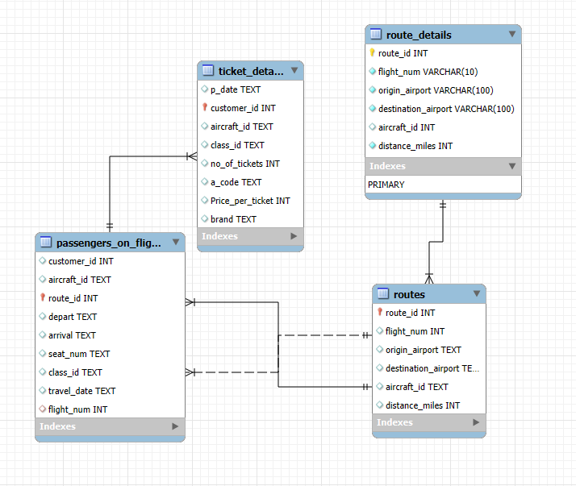
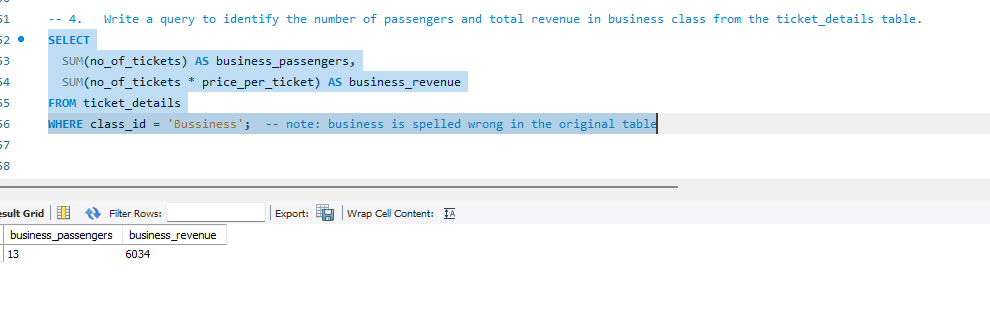
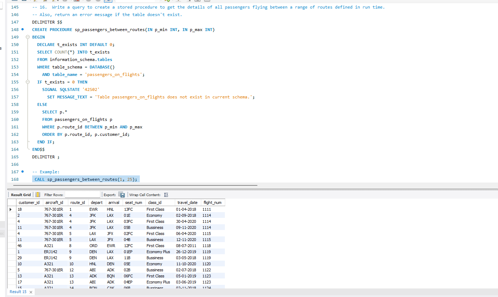
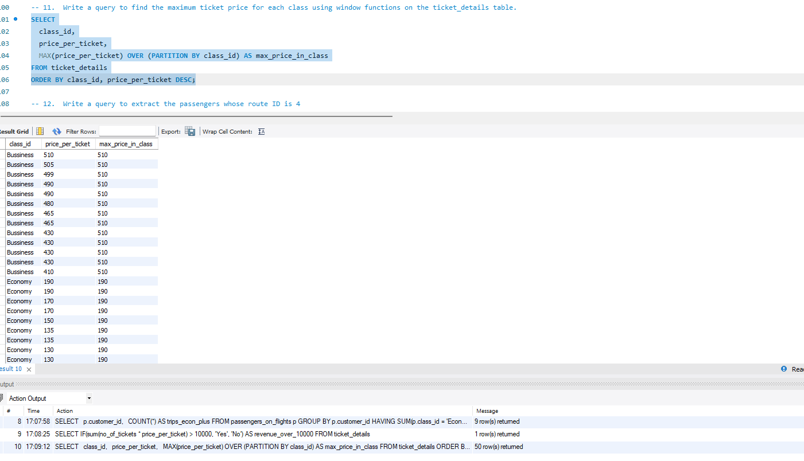

# Air Cargo SQL Analysis

## Project Overview

This project focuses on analyzing an air cargo and airline operations database using SQL.

The objective is to extract business insights related to passengers, ticket revenue, route performance, customer behavior, and airline operations through advanced SQL analysis.

---

# Business Objectives

- Analyze passenger activity and customer behavior
- Identify high-performing routes
- Calculate ticket revenue by travel class
- Perform route distance classification
- Apply advanced SQL concepts for business reporting
- Support operational and strategic decision-making

---

# Tools Used

- MySQL
- SQL
- MySQL Workbench
- ER Modeling
- Stored Procedures
- Window Functions

---

# SQL Concepts Applied

- Joins
- Group By & Having
- CASE Statements
- Window Functions
- Views
- Stored Procedures
- Stored Functions
- Constraints
- Indexing
- Cursors

---

# Main Analysis Areas

- Passenger Analysis
- Revenue Analysis
- Route Performance
- Business Class Revenue
- Distance-Based Route Classification
- Customer Segmentation

---

# Dashboard & Query Preview

## ER Diagram

The database schema and table relationships used for the analysis.



---

## Business Class Revenue Analysis

SQL analysis used to calculate revenue generated by business class passengers.



---

## Passenger Analysis

Customer and passenger analysis using SQL filtering and aggregation techniques.


---

## Route Distance Analysis

Route categorization and operational analysis based on travel distance.



---

## Window Function Analysis

Advanced SQL window functions applied for analytical reporting and partition-based calculations.



---

# Repository Structure

```text
air-cargo-sql-analysis/
│
├── README.md
├── sql/
├── diagrams/
├── screenshots/
└── documentation/
```

## Sample Business Questions

Which passengers travelled on routes between 1 and 25?
What is the total revenue generated from business class tickets?
Which customers booked tickets with Emirates?
Which routes are longer than 2,000 miles?
Which travel classes receive complimentary services?
Business Value

This project demonstrates how SQL can be used to analyze airline operations, customer behavior, ticket sales, and route performance in order to support better business decisions.

## Author
David Maria Olandese
